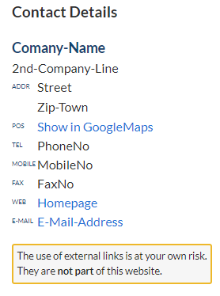

# Yellow Extension Adr

Creator for well formated adress display

## The Idea Behind

Sometimes you need a more or less big amount of different adress data *well formated* on a web site. To ease this, I created this extention for Yellow-CMS.

## How do I Install This?

1. Download and install [Datenstrom Yellow CMS](https://github.com/datenstrom/yellow/).
2. Download [adr extension](https://github.com/BsNoSi/yellow-extension-adr/archive/master.zip). If you are using Safari, right click and select 'Download file as'.
3. Copy the `adr-master.zip` into the `system/plugins` folder.

To uninstall simply delete the [extension files](https://github.com/BsNoSi/yellow-extention-adr/blob/master/extention.ini).

## Using the adr extention

`[adr name1 street city phone website e-mail-adress name2 fax mobile]`

All given parts are displayed in a structured form. You can leave out what you want. The order follows (descending my) typical availability and need of information details.

The output is in different order, only available (given) information is displayed. To skip parts use a hyphen. A result may look like this:

> All external links open in a new tab/window (depending to browser settings of the user).

There is no check if

- the address has a meaningful display in google maps
- any of the given addresses are valid

### Additional Files

- Translation files for German, English and French are included. You may change the texts to you needs.
- The css to achieve the displayed result above is included. You may change it to your theme style.

## Developer

[Norbert Simon](https://nosi.de/)

